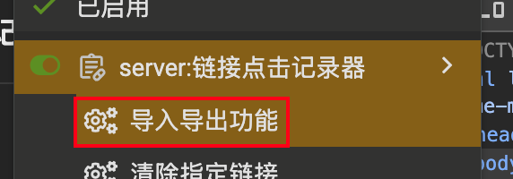
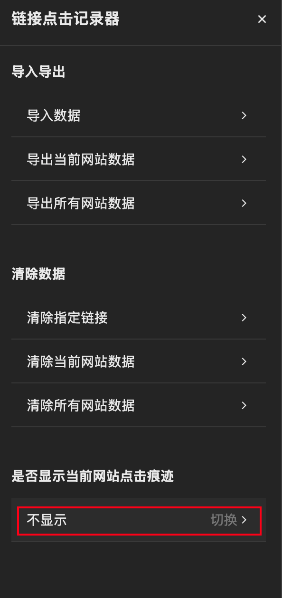

# 链接点击记录器

现如今有许多网站的链接，并没有记录是否点击过，该脚本能够记录点击的网站链接并将其置灰，以此能够直观知道哪些链接哪些文章已看过，同时支持导入导出功能避免数据丢失

## 安装

### 1. 安装油猴插件

前往 [Tampermonkey](https://www.tampermonkey.net/) 扩展

### 2. 安装油猴脚本

前往 [GreasyFork](https://greasyfork.org/zh-CN/scripts/554108) 安装脚本

## 配置

### 1. 打开菜单

点击脚本展开的选项，打开脚本菜单页面

### 2. 切换为显示

默认不会显示点击痕迹，点击菜单底部选项切换为显示，此时网站页面上的链接若点击过，则样式会被置灰

